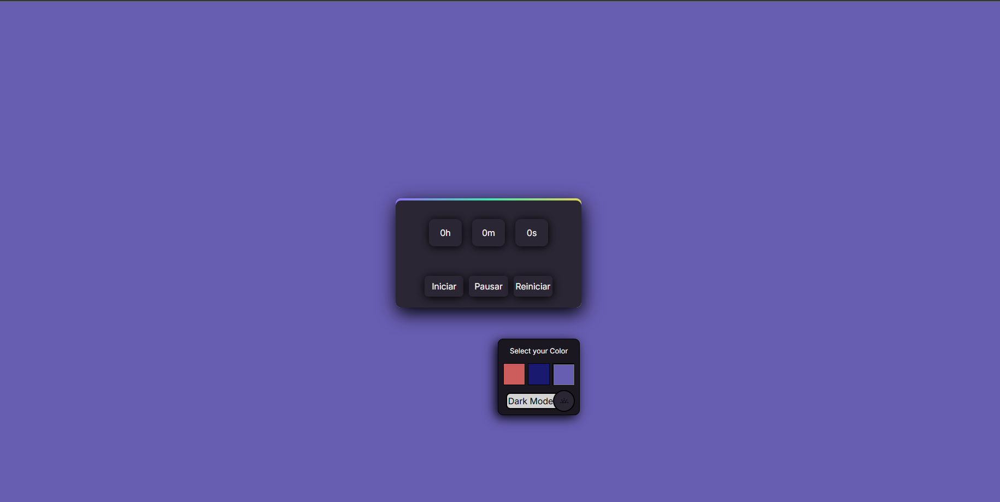

# 🕒 Timerdex - Cronômetro Moderno

Timerdex é um cronômetro simples, moderno e elegante feito com HTML, CSS e JavaScript. Ele permite que o usuário inicie, pause e reinicie a contagem do tempo, com um visual escuro estilizado e opções de personalização de cores e tema claro/escuro.

## 📸 Visual



## 🔧 Funcionalidades

- ⏱ Exibição de tempo (horas, minutos e segundos)
- ▶️ Botões de **Iniciar**, **Pausar** e **Reiniciar**
- 🎨 Seletor de cores para personalização do tema
- 🌙 Alternância entre **modo escuro** e **modo claro**
- 💅 Interface com design moderno e sombreamento suave (neumorphism)

## 🛠 Tecnologias Utilizadas

- HTML5
- CSS3 (com sombras e transições modernas)
- JavaScript (funcionalidades do cronômetro e interações)

## 🚀 Como Usar

1. Clone o repositório:

   ```bash
   git clone https://leonardojustino.github.io/timerdex/